# Games

This website is a questionaire game for those who are an avid fan of Harry Potter
It is an interactive game to test your knowledge when it comes to the Harry Potter Story
The user will get a chance to test his knowledge answering the trivia question. 
Hope everyone is Ready for this!!!!

The game is responsive in all media types.

     
# Features

## Introduction
    The plyaer will first be welcomed before the game starts. The user is then asked to 
    click to the Start the Game button so the user can start playing the game
 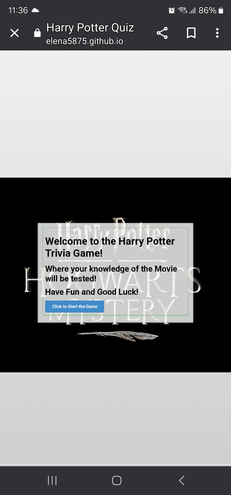

## Background and Heading: 
 The background of the website is the Heading also  "Harry Potter Hogwarts Mystery"
 The background has a black color with a silver color for the letters.
 This is to ensure that the user will immediately know that the trivia is
  all about Harry Potter Story

## Game Area
    
    The questionaire is at the middle of the screen.
    There is a transparent background and border so that the user can easily read
        the questions. 
    The questions should be easily readable and the buttons easily be seen
    At the left side at the end of the options the submit button should easily be seen
        and changes color when you hover your mouse over it.
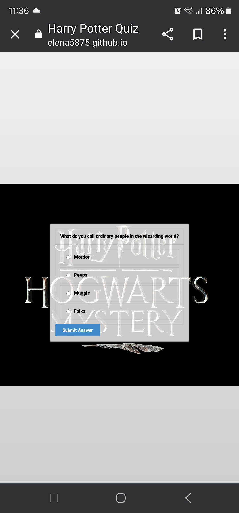

    Should the user accidentally click the submit button. The user will be alerted to 
    choose an answer before submitting
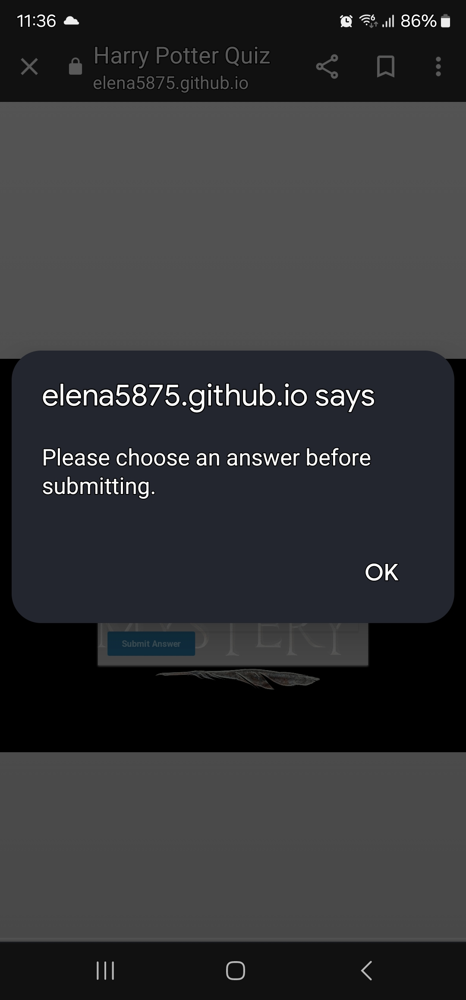
    
   
##  Score Area and Feedback
    After the user has answered all the question, It will show the number of correct answer you made. 
    The user can then choose to retry the questions again or show the correct answer.
    Should the user choose to click the retry button, the questions will be randomly placed 
    so the user will have a little challenge in answering the question again
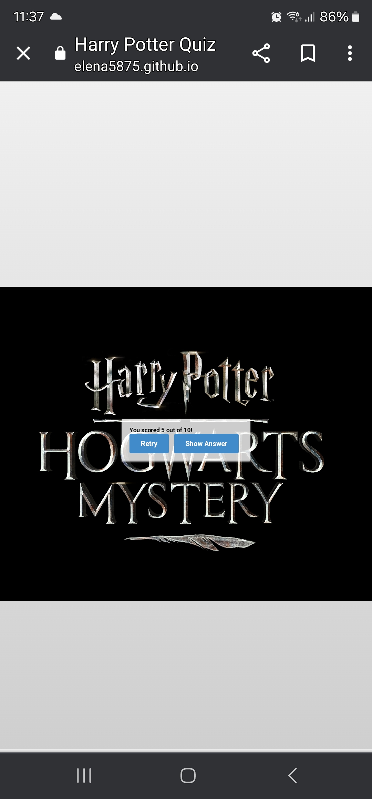
    However, should the user click the show answer. The User will be shown the correct answer on
    all the questions the user did not get.
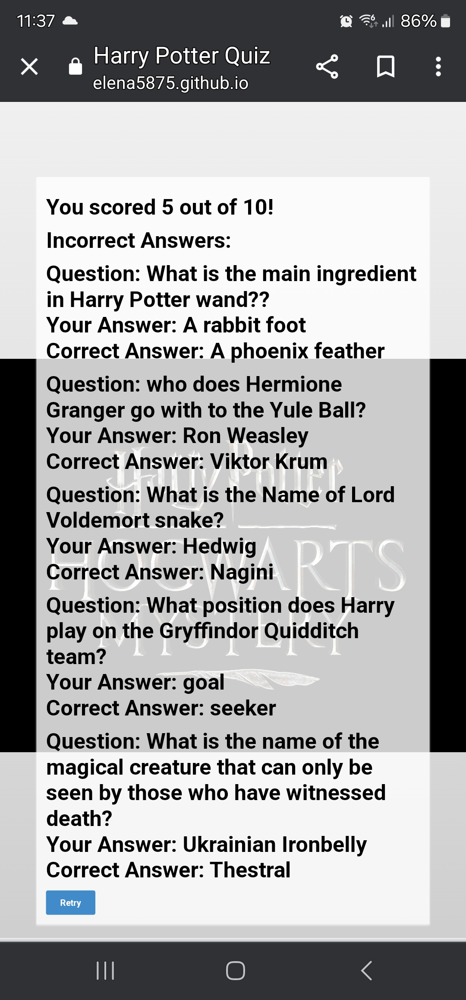
  

 #   Testing

 ## Validation:
  
    Html: There were no issues when the html code was validated thru w3 validator

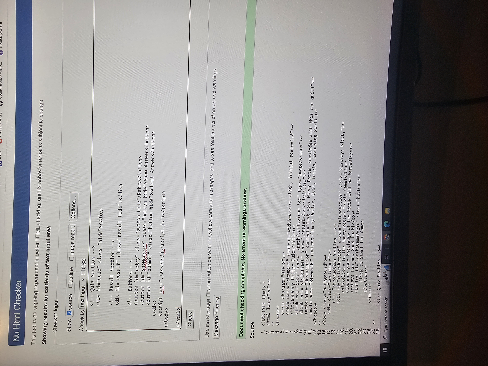
          CSS: There were no issues when the css code was validated thru the w3 validator

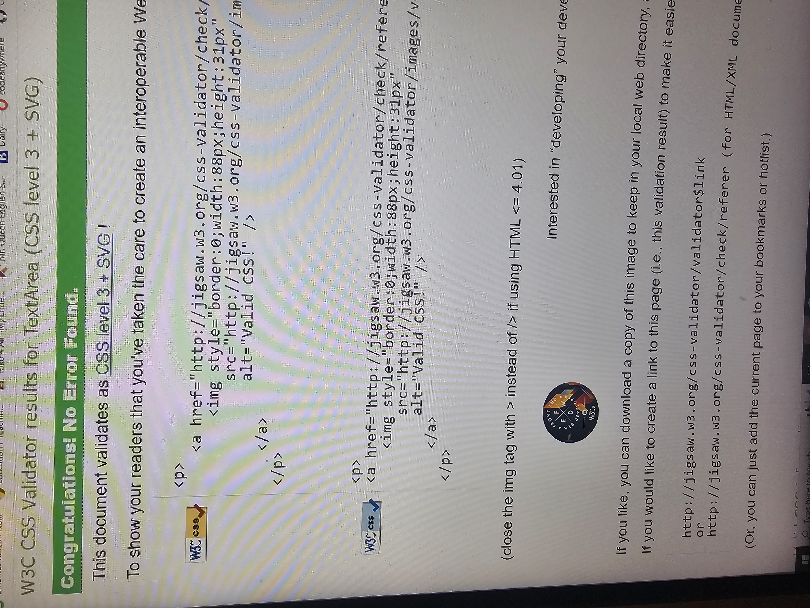 
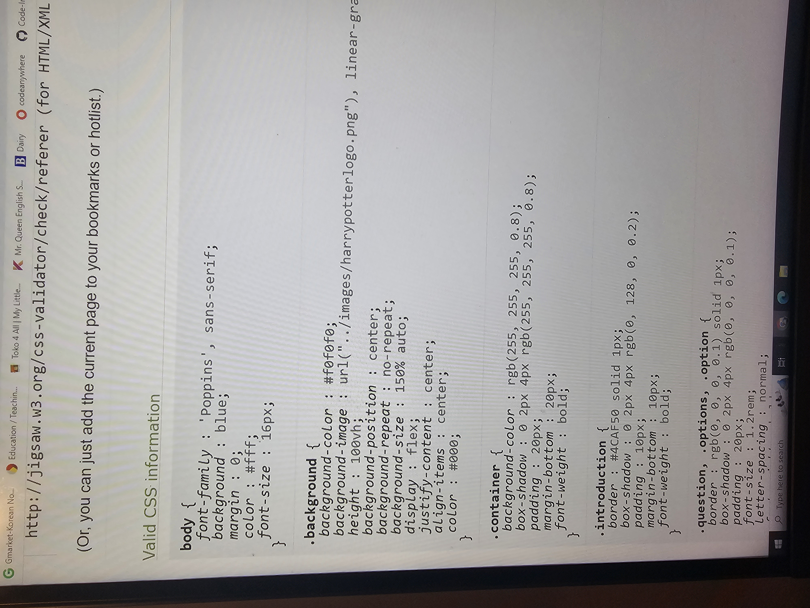 

 JavaScript: There were no major issue when the Javascript code was validated thru the Jshint website. 
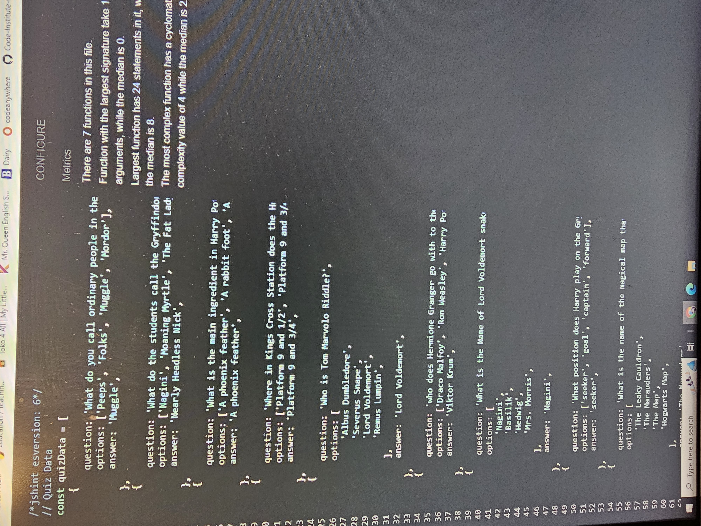

## Lighthouse Accessability Report: 
 The website was also inspected thru lighthouse and showed an accessability report of 90%
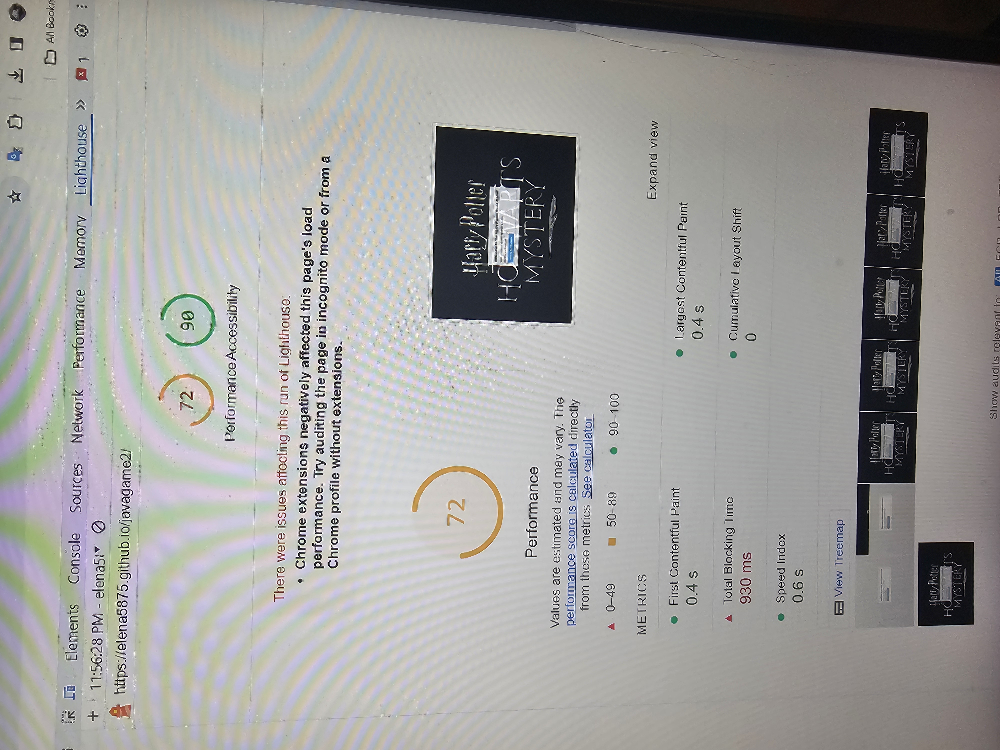
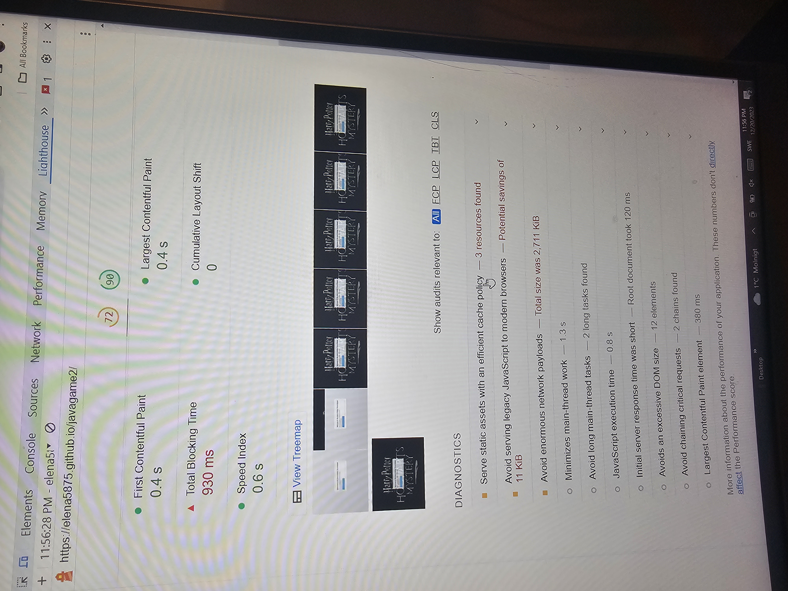
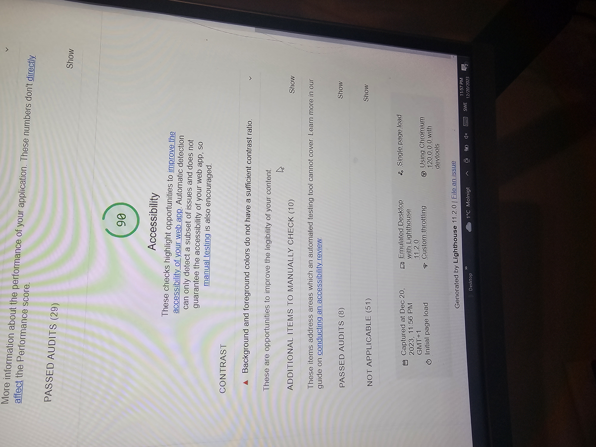
   
  ## Deployment
        
       My work was deployed thru github
      The following method was done:
        1. Go to github 
        2. Choose the repository elena5875/javagames2
        3. Go to Settings
        4. At the left side click pages
        5. Go to Branch and choose main. 
        6. Click Save. Wait for the repository to go live
        7. Once your site becomes live click visit site.

#    Credits

      All my content from Html, javascript and css were all based on this program:
        
      https://www.codewithfaraz.com/content/161/build-a-quiz-application-with-html-css-and-javascript-step-by-step-guide
      
    Other sources I used to create this game
    
    https://developer.mozilla.org/en-US/docs/Learn/JavaScript/First_steps
    https://developer.mozilla.org/en-US/docs/Web/CSS/Shorthand_properties
    https://www.w3schools.com/js/js_htmldom_events.asp

        
     Images were downloaded from this website:
    
   Harry Potter logo : https://hdqwalls.com/wallpaper/1360x768/harry-potter-hogwarts-mystery-game-logo
