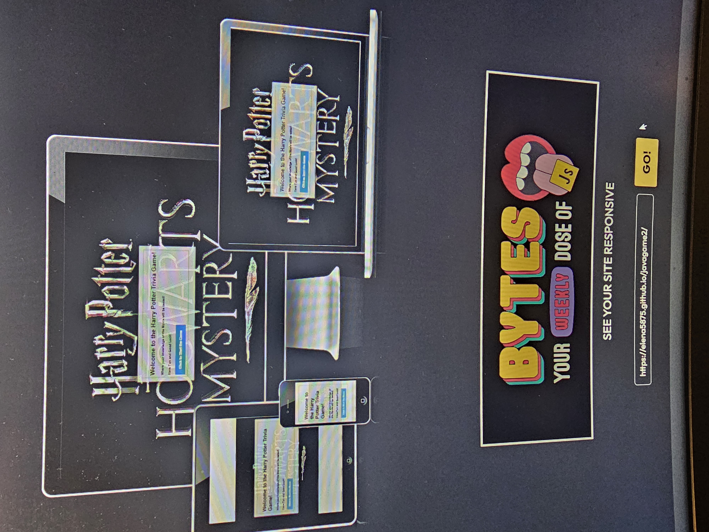

# Games

### This website is a questionaire game for those who are an avid fan of Harry Potter
### It is an interactive game to test your knowledge when it comes to the Harry Potter Story
### The user will get a chance to test his knowledge answering the trivia question. 
## Hope everyone is Ready for this!!!!

## The game is responsive in all media types.

     
# Features

### Background and Heading: The background of the website is the Heading also which says
##       "Harry Potter Hogwarts Mystery"
### The background has a black color with some silver color for the letters.
### This is to ensure that the user will immediately know that the trivia is
### all about Harry Potter Story

# Game Area
    
  ###  The questionaire is at the middle of the screen.
 ###   There is a transparent background and border so that the user can easily read
 ###   the questions. 
 ###   The questions should be easily readable and the buttons easily be seen
 ###   At the left side at the end of the options the submit button should easily be seen
 ###   and changes color when you hover your mouse over it.

   
  #  Score Area
  ###  After the user has answered all the question, It will show the number of correct answer you made. 
  

  #    Feedback
  ###  If you made a mistake, there is an icon that says Show Answer,
  ###  you can click the button and it will show you the right answer to the questions you made a mistake.
  ###  It will also have an option for you to retry answering the questions again.
  ###  However, the options for the questions will be randomly placed.

 

 #   Testing

  ##  Validation:
  
###     Html: There were no issues when the html code was validated thru w3 validator
    [embed]assets/images/result for html.pdf[/embed]
    
###     CSS: There were no issues when the css code was validated thru the w3 validator
    

###     JavaScript: There were no major issue when the Javascript code was validated thru the Jshint website. 

###     Lighthouse Accessability Report. The website was also inspected thru lighthouse and showed an accessability report of  %

   
##    Deployment
        
  ###      My work is being deployed at github
  ###    To get there you need to do the following:
  ###   1. Go to github 
  ###   2. Choose the repository elena5875/javagames2
  ###   3. Go to Settings
  ###   4. At the left side click pages
  ###   5. Go to Branch and choose main. 
  ###   6. Click Save. Wait for the repository to go live
  ###   7. Once your site becomes live click visit site.

#    Credits

###       All my content from Html, javascript and css were all based on this program:
        
  ###      https://www.codewithfaraz.com/content/161/build-a-quiz-application-with-html-css-and-javascript-step-by-step-guide

        
   ###     Images were downloaded from this website:
    
##    Harry Potter logo : https://hdqwalls.com/wallpaper/1360x768/harry-potter-hogwarts-mystery-game-logo
